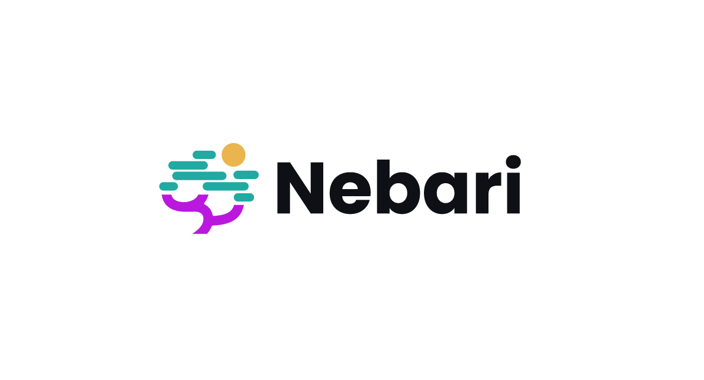
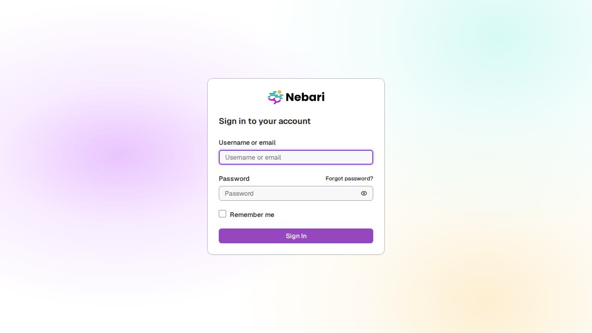

<p align="center">
  <a href="https://nebari.dev">
    <picture>
      <source media="(prefers-color-scheme: dark)" srcset="https://raw.githubusercontent.com/nebari-dev/nebari-design/main/logo-mark/horizontal/standard/Nebari-Logo-Horizontal-Lockup-White-text.png">
      <source media="(prefers-color-scheme: light)" srcset="https://raw.githubusercontent.com/nebari-dev/nebari-design/main/logo-mark/horizontal/standard/Nebari-Logo-Horizontal-Lockup.png">
      
    </picture>
  </a>
</p>

<h1 align="center">Nebari Keycloak Theme</h1>

<p align="center">
  <strong>Sign-in, account and admin screens for Keycloak, in the Nebari design system.</strong><br />
  One theme covers the login pages every user sees first, the self-service Account console and the Admin
  Console, so authentication looks like the rest of Nebari instead of stock Keycloak.
</p>

<p align="center">
  <picture>
    <source media="(prefers-color-scheme: dark)" srcset="tests/screenshots/linux/full-page-dark.png">
    <source media="(prefers-color-scheme: light)" srcset="tests/screenshots/linux/full-page-light.png">
    
  </picture>
</p>

<p align="center">
  <a href="https://github.com/nebari-dev/nebari-keycloak-theme/actions/workflows/playwright.yml"></a>
  <a href="https://github.com/nebari-dev/nebari-keycloak-theme/actions/workflows/publish-keycloak-image.yml"></a>
  <a href="https://github.com/nebari-dev/nebari-keycloak-theme/releases/latest"></a>
  <a href="LICENSE"></a>
  <a href="https://www.keycloak.org"></a>
  <a href="https://www.keycloakify.dev"></a>
</p>

<p align="center">
  <a href="docs/quick-start.md">Quick start</a> &middot;
  <a href="docs/development.md">Development</a> &middot;
  <a href="docs/architecture.md">Architecture</a> &middot;
  <a href="docs/deployment.md">Deployment</a> &middot;
  <a href="docs/customization.md">Customization</a> &middot;
  <a href="AGENTS.md">AGENTS.md</a>
</p>

> **Status:** v1 is released and published as a container image, but no Nebari Infrastructure Core (NIC)
> component selects it yet. Selecting it in a deployment is a per-realm setting &mdash; see
> [Deployment](docs/deployment.md#selecting-the-theme).

## What is in it

The theme is built with [Keycloakify](https://www.keycloakify.dev/) and ships as one JAR containing three
Keycloak themes, all named `nebari`:

| Theme | What it covers | How it is built |
| --- | --- | --- |
| **Login** | Sign in, register, reset and update password, verify email, update profile, info and error pages | Written for this repo on the Nebari design-system components |
| **Account** | The self-service Account console | Keycloak's own console, restyled through a component shim and a token bridge |
| **Admin** | The Admin Console | Same approach as Account, plus a Nebari sidebar, data table and header |

The consoles are roughly 520 views vendored from Keycloak. Rather than rewriting them, the theme swaps the
components they import underneath them, so upstream Keycloak changes keep flowing in. How that works, and
where it stops, is in [Architecture](docs/architecture.md).

## Quick start

You need Node.js `^20.19` or `>=22.12` and Docker.

```bash
npm install
npm run build-keycloak-theme           # builds the JARs into dist_keycloak/
docker compose up -d --build keycloak  # Keycloak 26 with the theme and a seeded dev realm
```

Then sign in on the `nebari` realm:

| Console | URL | Sign in as |
| --- | --- | --- |
| Admin | http://localhost:8080/admin/nebari/console/ | `nebari-admin` / `nebari-admin` |
| Account | http://localhost:8080/realms/nebari/account/ | `demo` / `demo` |

For login-page work you don't need Keycloak at all &mdash; `npm run dev` serves every login page from a mock
context at http://localhost:5173/?preview=login. [Quick start](docs/quick-start.md) covers both loops and why
`master` still shows the stock consoles.

## Project layout

| Path | What lives there |
| --- | --- |
| `src/login/` | The login theme: page router, template, pages, preview mocks, translations |
| `src/admin/`, `src/account/` | The consoles. Mostly vendored from Keycloak and gitignored; the tracked files are the ones this theme owns |
| `src/shared/` | Vendored code shared by both consoles, including the PatternFly shim every view imports through |
| `src/components/ui/` | Nebari design-system components from the `@nebari` registry. Upstream-managed &mdash; never edit |
| `src/components/patternfly/` | Adapters that present PatternFly's API and render Nebari components |
| `src/components/nebari/` | Compositions owned by this repo, such as the profile menu and password field |
| `src/theme.css` | Tokens, the cascade-layer order, and login-page styles |
| `scripts/` | Upgrade guards that catch silent breakage on a Keycloak bump |
| `tests/` | Playwright screenshot tests and their Linux baselines |
| `docs/` | Everything below |

## Documentation

| Guide | What is in it |
| --- | --- |
| [Quick start](docs/quick-start.md) | The two dev loops, the seeded realm, and which URL to open |
| [Development](docs/development.md) | Scripts, previews, screenshot baselines, upgrade guards and what CI runs |
| [Architecture](docs/architecture.md) | The three themes, the component shim, cascade layers and theme state |
| [Ownership](docs/ownership.md) | Which Keycloak files this theme forks, why, and what keeps them honest |
| [Customization](docs/customization.md) | Tokens, logo, translations, login pages and design-system components |
| [Deployment](docs/deployment.md) | JARs, the published image, and selecting the theme on a realm |
| [Releasing](docs/releasing.md) | The publish workflow, versioning and dependency policy |
| [AGENTS.md](AGENTS.md) | Working agreement for coding agents, including mistakes already made here |

### Decision records

Real choices get a record in [`docs/adr/`](docs/adr/), numbered and append-only &mdash; to change one, add a
new record that marks the old one superseded.

| | |
| --- | --- |
| [0001](docs/adr/0001-adopt-the-nebari-design-registry.md) | Build the login pages on the `@nebari` design-system registry |
| [0002](docs/adr/0002-restyle-the-consoles-through-a-shim.md) | Restyle the consoles through a PatternFly shim, not by forking views |
| [0003](docs/adr/0003-pin-the-cascade-layer-order.md) | Pin one cascade-layer order and wrap PatternFly in its own layer |
| [0004](docs/adr/0004-keep-owned-files-few-and-guarded.md) | Keep owned files few, and guard the ones that stay owned |

## License

[Apache License 2.0](LICENSE).
