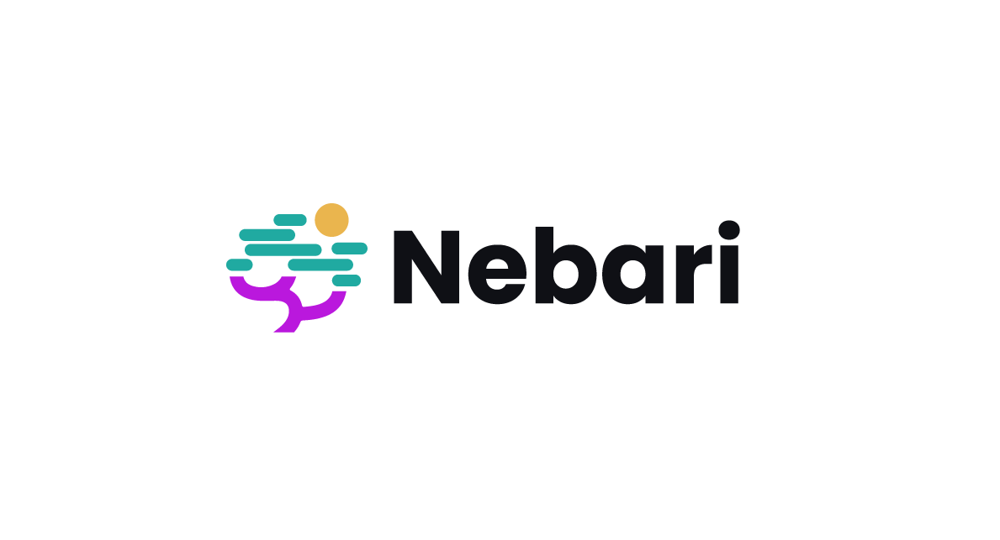
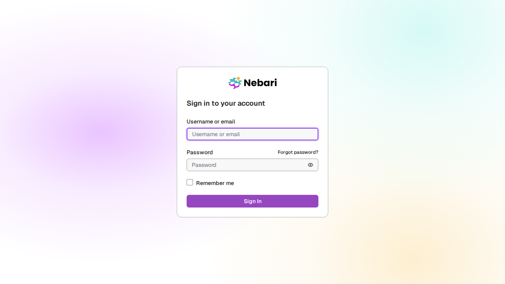
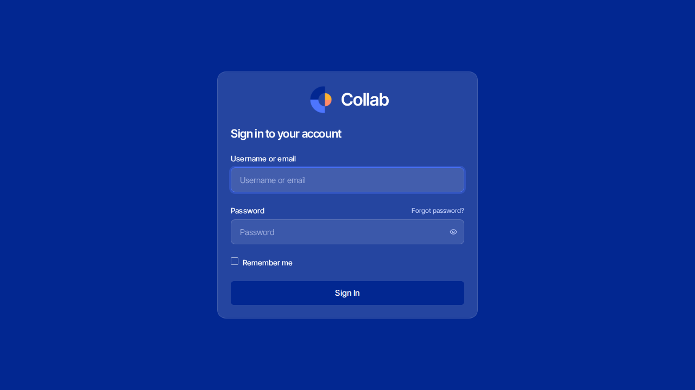

<p align="center">
  <a href="https://nebari.dev">
    <picture>
      <source media="(prefers-color-scheme: dark)" srcset="https://raw.githubusercontent.com/nebari-dev/nebari-design/main/logo-mark/horizontal/standard/Nebari-Logo-Horizontal-Lockup-White-text.png">
      <source media="(prefers-color-scheme: light)" srcset="https://raw.githubusercontent.com/nebari-dev/nebari-design/main/logo-mark/horizontal/standard/Nebari-Logo-Horizontal-Lockup.png">
      
    </picture>
  </a>
</p>

<h1 align="center">Nebari Keycloak Theme</h1>

<p align="center">
  <strong>Sign-in, account and admin screens for Keycloak, in the Nebari design system.</strong><br />
  One theme covers the login pages every user sees first, the self-service Account console and the Admin
  Console, so authentication looks like the rest of Nebari instead of stock Keycloak.
</p>

<p align="center">
  <picture>
    <source media="(prefers-color-scheme: dark)" srcset="tests/screenshots/linux/nebari/full-page-dark.png">
    <source media="(prefers-color-scheme: light)" srcset="tests/screenshots/linux/nebari/full-page-light.png">
    
  </picture>
  
</p>

<p align="center">
  <a href="https://github.com/nebari-dev/nebari-keycloak-theme/actions/workflows/playwright.yml"></a>
  <a href="https://github.com/nebari-dev/nebari-keycloak-theme/actions/workflows/publish-keycloak-image.yml"></a>
  <a href="https://github.com/nebari-dev/nebari-keycloak-theme/releases/latest"></a>
  <a href="LICENSE"></a>
  <a href="https://www.keycloak.org"></a>
  <a href="https://www.keycloakify.dev"></a>
</p>

<p align="center">
  <a href="docs/quick-start.md">Quick start</a> &middot;
  <a href="docs/development.md">Development</a> &middot;
  <a href="docs/architecture.md">Architecture</a> &middot;
  <a href="docs/deployment.md">Deployment</a> &middot;
  <a href="docs/customization.md">Customization</a> &middot;
  <a href="AGENTS.md">AGENTS.md</a>
</p>

> **Status:** v1 is released and published as a container image, but no Nebari Infrastructure Core (NIC)
> component selects it yet. Selecting it in a deployment is a per-realm setting &mdash; see
> [Deployment](docs/deployment.md#selecting-the-theme).

## What is in it

The theme is built with [Keycloakify](https://www.keycloakify.dev/) and ships two brands, `nebari` and
`collab` (OpenTeams Collab). Each brand is packaged in its own JAR and published as its own image, and each
JAR contains three Keycloak themes under that brand's name:

| Theme | What it covers | How it is built |
| --- | --- | --- |
| **Login** | Sign in, register, reset and update password, verify email, update profile, info and error pages | Written for this repo on the Nebari design-system components |
| **Account** | The self-service Account console | Keycloak's own console, restyled through a component shim and a token bridge |
| **Admin** | The Admin Console | Same approach as Account, plus a Nebari sidebar, data table and header |

The consoles are roughly 520 views vendored from Keycloak. Rather than rewriting them, the theme swaps the
components they import underneath them, so upstream Keycloak changes keep flowing in. How that works, and
where it stops, is in [Architecture](docs/architecture.md).

## Brands

`nebari` and `collab` share one build and one stylesheet. The brand is the theme Keycloak is rendering:
`src/main.tsx` stamps `kcContext.themeName` on `<html>` as `data-brand`, and the login page, the Admin Console
masthead and the Admin dashboard's hero mark read it from there.

| | Nebari | Collab |
| --- | --- | --- |
| Theme name | `nebari` | `collab` |
| JAR, Keycloak 26+ | `nebari-keycloak-theme-for-kc-all-other-versions.jar` | `collab-keycloak-theme-for-kc-all-other-versions.jar` |
| JAR, Keycloak 22 to 25 | `nebari-keycloak-theme-for-kc-22-to-25.jar` | `collab-keycloak-theme-for-kc-22-to-25.jar` |
| Image | `ghcr.io/nebari-dev/nebari-keycloak-theme` | `ghcr.io/nebari-dev/collab-keycloak-theme` |

Collab takes its look from the openteams.com landing page: a deep-blue ground, Inter Tight, a glass card and
pill buttons. Those rules are the `html[data-brand="collab"]` block in [`src/theme.css`](src/theme.css),
covering the login pages and both consoles. Strings that
name the product are keyed by theme in [`src/login/i18n.ts`](src/login/i18n.ts). `collab` was called
`openteams` before, so a realm that still selects `openteams` must be switched to `collab`.

To add a brand, add its name to [`themes.json`](themes.json), an entry in
[`src/lib/branding.ts`](src/lib/branding.ts) (the only place a logo path is written down), a theme entry at
the top of [`tests/visual.spec.ts`](tests/visual.spec.ts), and a `data-brand` rule in `src/theme.css` if the
mark needs more than an ``.

## Quick start

You need Node.js `^20.19` or `>=22.12` and Docker.

```bash
npm install
npm run build-keycloak-theme           # builds all four JARs into dist_keycloak/
docker compose up -d --build keycloak  # Keycloak 26 with both themes and a seeded dev realm
```

To build one brand only, run `npm run build-keycloak-theme -- --theme collab`; `-- --list` prints the
available names. The `--` is needed so npm passes the flags on to the script. Building needs Java 17+ and
Maven, which Keycloakify calls to assemble the JARs.

The seeded realm selects `nebari`. To try Collab, switch the realm's themes to `collab` under
**Realm settings &rarr; Themes**.

Then sign in on the `nebari` realm:

| Console | URL | Sign in as |
| --- | --- | --- |
| Admin | http://localhost:8080/admin/nebari/console/ | `nebari-admin` / `nebari-admin` |
| Account | http://localhost:8080/realms/nebari/account/ | `demo` / `demo` |

For login-page work you don't need Keycloak at all &mdash; `npm run dev` serves every login page from a mock
context at http://localhost:5173/?preview=login. Add `&theme=collab` to preview the Collab brand, for example
http://localhost:5173/?preview=login-providers&theme=collab. [Quick start](docs/quick-start.md) covers both loops and why
`master` still shows the stock consoles.

## Project layout

| Path | What lives there |
| --- | --- |
| `src/login/` | The login theme: page router, template, pages, preview mocks, translations |
| `src/admin/`, `src/account/` | The consoles. Mostly vendored from Keycloak and gitignored; the tracked files are the ones this theme owns |
| `src/shared/` | Vendored code shared by both consoles, including the PatternFly shim every view imports through |
| `src/components/ui/` | Nebari design-system components from the `@nebari` registry. Upstream-managed &mdash; never edit |
| `src/components/patternfly/` | Adapters that present PatternFly's API and render Nebari components |
| `src/components/nebari/` | Compositions owned by this repo, such as the profile menu and password field |
| `src/lib/branding.ts` | Each brand's logo paths |
| `src/theme.css` | Tokens, the cascade-layer order, login-page styles, and the Collab `data-brand` rules |
| `themes.json` | The brands to build; one JAR pair per brand |
| `scripts/` | The per-brand JAR build, and upgrade guards that catch silent breakage on a Keycloak bump |
| `tests/` | Playwright screenshot tests and their Linux baselines, one folder per brand |
| `docs/` | Everything below |

## Documentation

| Guide | What is in it |
| --- | --- |
| [Quick start](docs/quick-start.md) | The two dev loops, the seeded realm, and which URL to open |
| [Development](docs/development.md) | Scripts, previews, screenshot baselines, upgrade guards and what CI runs |
| [Architecture](docs/architecture.md) | The three themes, the component shim, cascade layers and theme state |
| [Ownership](docs/ownership.md) | Which Keycloak files this theme forks, why, and what keeps them honest |
| [Customization](docs/customization.md) | Tokens, logo, translations, login pages and design-system components |
| [Deployment](docs/deployment.md) | JARs, the published image, and selecting the theme on a realm |
| [Releasing](docs/releasing.md) | The publish workflow, versioning and dependency policy |
| [AGENTS.md](AGENTS.md) | Working agreement for coding agents, including mistakes already made here |

### Decision records

Real choices get a record in [`docs/adr/`](docs/adr/), numbered and append-only &mdash; to change one, add a
new record that marks the old one superseded.

| | |
| --- | --- |
| [0001](docs/adr/0001-adopt-the-nebari-design-registry.md) | Build the login pages on the `@nebari` design-system registry |
| [0002](docs/adr/0002-restyle-the-consoles-through-a-shim.md) | Restyle the consoles through a PatternFly shim, not by forking views |
| [0003](docs/adr/0003-pin-the-cascade-layer-order.md) | Pin one cascade-layer order and wrap PatternFly in its own layer |
| [0004](docs/adr/0004-keep-owned-files-few-and-guarded.md) | Keep owned files few, and guard the ones that stay owned |

## License

[Apache License 2.0](LICENSE).
