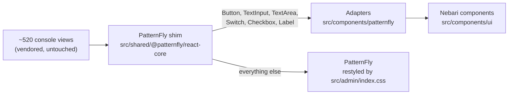

# Architecture

## Three themes in one JAR

`keycloakify build` packages one JAR containing three Keycloak themes, all named `nebari` (set by `themeName`
in [`vite.config.ts`](../vite.config.ts)). They are built very differently, because the problem is different for
each:

| Theme | Size of the problem | Approach |
| --- | --- | --- |
| Login | A dozen pages, rendered by Keycloak from a context object | Written from scratch in `src/login/` on design-system components |
| Account | A full React app Keycloak ships | Keep Keycloak's app; swap the components underneath it |
| Admin | ~520 views, also a full React app | Same as Account, plus a Nebari sidebar, data table and header |

The login theme is ordinary code this repo owns. The consoles are the interesting part: rewriting 520 views
would mean owning 520 files that Keycloak keeps changing, forever. So the theme leaves the views alone and
changes what they are made of.

## The login theme

[`src/login/KcPage.tsx`](../src/login/KcPage.tsx) routes on the page Keycloak asks for. Eight pages have custom
implementations in [`src/login/pages/`](../src/login/pages/) &mdash; sign in, register, info, error, reset
password, update password, verify email and update profile. Every other page falls through to Keycloakify's
default implementation, so a page this theme hasn't written still works, just unstyled.

All eight share [`src/login/Template.tsx`](../src/login/Template.tsx) for the card, logo and messages, and are
built from the design-system components &mdash; `Field`, `Input`, `Button`, `Checkbox`, `Alert` &mdash; plus
[`PasswordField`](../src/components/nebari/PasswordField.tsx) for the reveal toggle.

[`src/main.tsx`](../src/main.tsx) is the entry point. In production Keycloak injects the context; in the dev
server the `?preview=` mock stands in for it.

## The consoles: swapping components underneath

Every console view imports PatternFly the same way, through one module:
[`src/shared/@patternfly/react-core/index.tsx`](../src/shared/@patternfly/react-core/index.tsx). Keycloakify
generates that file as a one-line `export * from "@patternfly/react-core"`. This theme owns it and adds a few
exports after the wildcard. In ES modules an explicit export wins over a re-exported one, so those names now
resolve to Nebari components &mdash; in every view, without editing any of them.



That gives three tiers, and each has one rule:

| Tier | Path | Rule |
| --- | --- | --- |
| Design-system components | `src/components/ui/` | **Never edit.** Installed from the `@nebari` registry, which overwrites them on upgrade |
| Adapters | `src/components/patternfly/` | Present PatternFly's API exactly, render a Nebari component. Change look through `className` and the Base UI `render` prop |
| Everything else | stays PatternFly | Restyled to the same tokens by [`src/admin/index.css`](../src/admin/index.css) |

Some components stay on PatternFly deliberately &mdash; specialised table bodies, `Radio`, `Select`, `Modal`,
toast alerts and `variant="control"` buttons, which are built to sit flush against an input group. The
reasoning for each is in [`src/components/patternfly/README.md`](../src/components/patternfly/README.md).

### Things the adapters have to get exactly right

The views were written against PatternFly, so an adapter that differs from PatternFly in any observable way
breaks every view that relies on it. Three cases have mattered:

- **Refs.** Forms spread `{...register("field")}` from react-hook-form onto these controls, and that carries a
  callback ref. React 18 won't pass `ref` through a plain function component, so each adapter forwards it
  explicitly. Without that, fields render and save blank.
- **Change events.** PatternFly's `onChange` is `(event, value)`. Base UI's `onCheckedChange` passes an
  `eventDetails` wrapper instead of an event, so the adapters build a change event from
  `eventDetails.event`. Before that fix, react-hook-form stored the whole wrapper object as a checkbox's value.
- **Prop precedence.** PatternFly lets `readOnlyVariant` win over `readOnly`. The adapter matches, so an
  explicit `readOnly={false}` can't re-enable a field the console marked immutable.

## Cascade layers

The single most load-bearing line of styling setup is at the top of [`src/theme.css`](../src/theme.css):

```css
@layer theme, base, patternfly, components, utilities;
```

PatternFly ships its CSS unlayered, and **unlayered CSS beats every cascade layer, regardless of selector
specificity.** So PatternFly's global reset (`* { padding: 0 }`) was beating every Tailwind utility and
stripping design-system components of their padding, font size and layout.

The `patternflyCssLayer` plugin in [`vite.config.ts`](../vite.config.ts) wraps each PatternFly stylesheet in a
`patternfly` layer at build time. Where that layer sits is the whole point:

- **above `base`**, so Tailwind's reset doesn't strip PatternFly's own padding and borders
- **below `utilities`**, so a utility class on a design-system component still beats PatternFly's reset

The plugin repeats the order statement at the top of every PatternFly file, because a layer's position is fixed
the first time the browser sees its name, and PatternFly's CSS can load before `theme.css` does.

**Before adding CSS, decide which layer it belongs in.** Two mistakes have already been made here:

- **Unlayered rules beat design-system components too.** Bare element selectors written for the login pages
  (`a`, `input[type="text"]`) leaked into the consoles and overrode component styling. They are now scoped with
  `:where(.nebari-login-wrapper)`, which confines them without adding specificity. Watch the specificity when
  you scope: wrapping `:not([data-slot])` in `:where()` matters, because a bare `:not()` counts as an attribute
  selector and was enough to turn the social sign-in buttons purple.
- **`src/admin/index.css` is unlayered by default.** A rule there outranks every named layer however weak its
  selector &mdash; one pinned an error icon onto every valid field by beating Tailwind's `hidden` utility. Put
  rules there inside a layer unless they genuinely need to win.

## Theme state

Light, dark or system is one preference, stored in `localStorage` under `nebari-admin-theme` and shared by the
login pages and both consoles. It has to be mirrored onto two theming systems &mdash; Nebari's tokens key off
`.dark` and `[data-theme]`, PatternFly's off `.pf-v5-theme-dark` &mdash; and applied early enough to avoid a
flash of the wrong theme.

Three pieces do that, in order:

| When | What | File |
| --- | --- | --- |
| Before the page paints | Reads the stored preference, sets both classes and the background | `public/keycloak-theme/{admin,account}/early-color-scheme.js` |
| Before React mounts | Same, plus cross-tab sync and the realm's Dark Mode setting | `src/{admin,account}/colorScheme.ts` |
| While the app runs | Owns `.dark`; mirrors it onto PatternFly | `useThemePreference`, then `useNebariTheme` |

**`.dark` has exactly one owner, `useThemePreference`.** `useNebariTheme` only mirrors the resolved state onto
PatternFly, `[data-theme]` and `color-scheme`. It must be mounted once per document, so each console calls it
in its header and passes the mode down.

If a realm turns Dark Mode off (**Realm settings &rarr; Themes**), the header doesn't mount the hook at all and
`colorScheme.ts` holds the page in light mode.

The pre-paint scripts and `colorScheme.ts` must change together. The upstream `colorScheme.ts` in
`@keycloakify/keycloak-admin-ui` says so in its opening comment: change how dark mode works and you must
update the early script too.

## Known gaps

- **`src/account/nebari-account.css`** is an older restyling of PatternFly with hardcoded hex values rather
  than tokens. The Account console won't be fully consistent until it is converted.
- **Two ways to style login fields.** The update-profile page, and registration when the realm has User Profile
  enabled, render fields through Keycloakify's `UserProfileFormFields`, which takes CSS class names rather than
  components. So the `.nebari-*` field classes have to be kept visually in step with the components by hand.
- **React 18 versus the registry.** Registry components take `ref` as a plain prop, the React 19 convention.
  Where a DOM node is needed &mdash; menu triggers, tooltips &mdash; the theme renders one through the `render`
  prop, and the PatternFly tooltip is still used for that reason.
- **The consoles have no automated tests.** See [Development](development.md#what-ci-checks).
